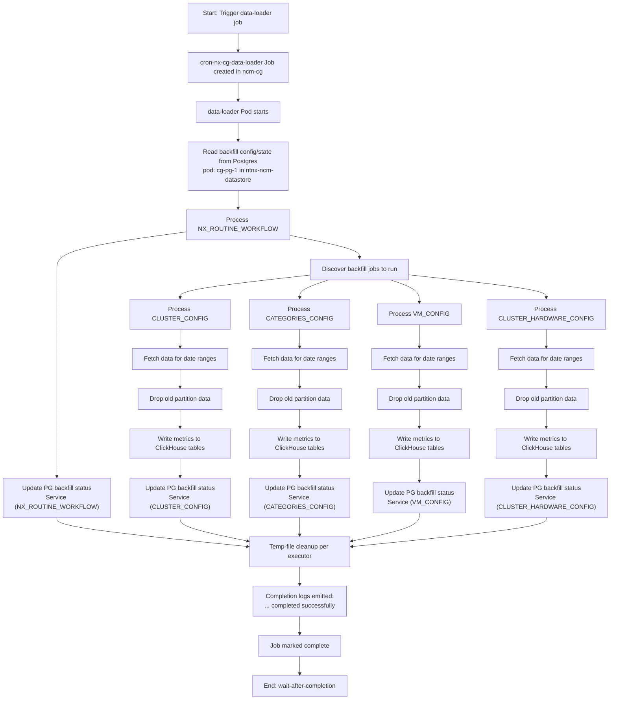
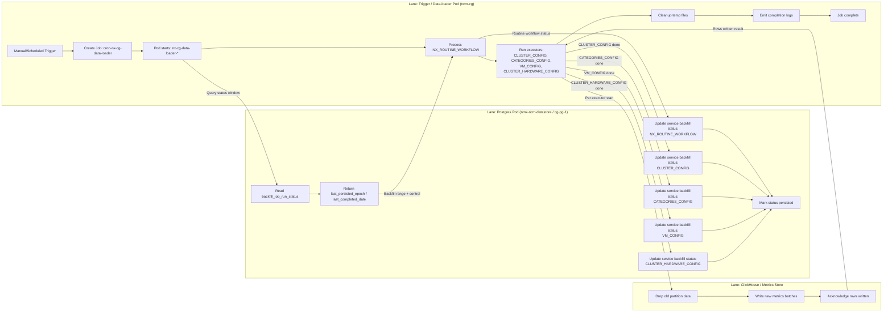

# Data Loader Success Flowcharts

## End-to-End Flow

```mermaid
flowchart TD
    A[Start: Trigger data-loader job] --> B[cron-nx-cg-data-loader Job created in ncm-cg]
    B --> C[data-loader Pod starts]
    C --> D[Read backfill config/state from Postgres<br/>pod: cg-pg-1 in ntnx-ncm-datastore]

    D --> E[Process NX_ROUTINE_WORKFLOW]
    E --> F[Discover backfill jobs to run]

    F --> G1[Process CLUSTER_CONFIG]
    F --> G2[Process CATEGORIES_CONFIG]
    F --> G3[Process VM_CONFIG]
    F --> G4[Process CLUSTER_HARDWARE_CONFIG]

    G1 --> H1[Fetch data for date ranges]
    G2 --> H2[Fetch data for date ranges]
    G3 --> H3[Fetch data for date ranges]
    G4 --> H4[Fetch data for date ranges]

    H1 --> I1[Drop old partition data]
    H2 --> I2[Drop old partition data]
    H3 --> I3[Drop old partition data]
    H4 --> I4[Drop old partition data]

    I1 --> J1[Write metrics to ClickHouse tables]
    I2 --> J2[Write metrics to ClickHouse tables]
    I3 --> J3[Write metrics to ClickHouse tables]
    I4 --> J4[Write metrics to ClickHouse tables]

    J1 --> K1["Update PG backfill status<br/>Service (CLUSTER_CONFIG)"]
    J2 --> K2["Update PG backfill status<br/>Service (CATEGORIES_CONFIG)"]
    J3 --> K3["Update PG backfill status<br/>Service (VM_CONFIG)"]
    J4 --> K4["Update PG backfill status<br/>Service (CLUSTER_HARDWARE_CONFIG)"]

    E --> K0["Update PG backfill status<br/>Service (NX_ROUTINE_WORKFLOW)"]

    K0 --> L[Temp-file cleanup per executor]
    K1 --> L[Temp-file cleanup per executor]
    K2 --> L
    K3 --> L
    K4 --> L

    L --> M[Completion logs emitted:<br/>... completed successfully]
    M --> N[Job marked complete]
    N --> O[End: wait-after-completion]
```

## Pod-to-Pod Swimlane

```mermaid
flowchart LR
    subgraph A["Lane: Trigger / Data-loader Pod (ncm-cg)"]
        A1[Manual/Scheduled Trigger] --> A2[Create Job: cron-nx-cg-data-loader]
        A2 --> A3[Pod starts: nx-cg-data-loader-*]
        A3 --> A4[Process NX_ROUTINE_WORKFLOW]
        A4 --> A5[Run executors:<br/>CLUSTER_CONFIG, CATEGORIES_CONFIG,<br/>VM_CONFIG, CLUSTER_HARDWARE_CONFIG]
        A5 --> A6[Cleanup temp files]
        A6 --> A7[Emit completion logs]
        A7 --> A8[Job complete]
    end

    subgraph B["Lane: Postgres Pod (ntnx-ncm-datastore / cg-pg-1)"]
        B1[Read backfill_job_run_status] --> B2[Return last_persisted_epoch / last_completed_date]
        B3[Update service backfill status:<br/>NX_ROUTINE_WORKFLOW] --> B4[Mark status persisted]
        B5[Update service backfill status:<br/>CLUSTER_CONFIG] --> B4
        B6[Update service backfill status:<br/>CATEGORIES_CONFIG] --> B4
        B7[Update service backfill status:<br/>VM_CONFIG] --> B4
        B8[Update service backfill status:<br/>CLUSTER_HARDWARE_CONFIG] --> B4
    end

    subgraph C["Lane: ClickHouse / Metrics Store"]
        C1[Drop old partition data] --> C2[Write new metrics batches]
        C2 --> C3[Acknowledge rows written]
    end

    A3 -->|Query status window| B1
    B2 -->|Backfill range + control| A4

    A5 -->|Per executor start| C1
    C3 -->|Rows written result| A5

    A4 -->|Routine workflow status| B3
    A5 -->|CLUSTER_CONFIG done| B5
    A5 -->|CATEGORIES_CONFIG done| B6
    A5 -->|VM_CONFIG done| B7
    A5 -->|CLUSTER_HARDWARE_CONFIG done| B8
```

