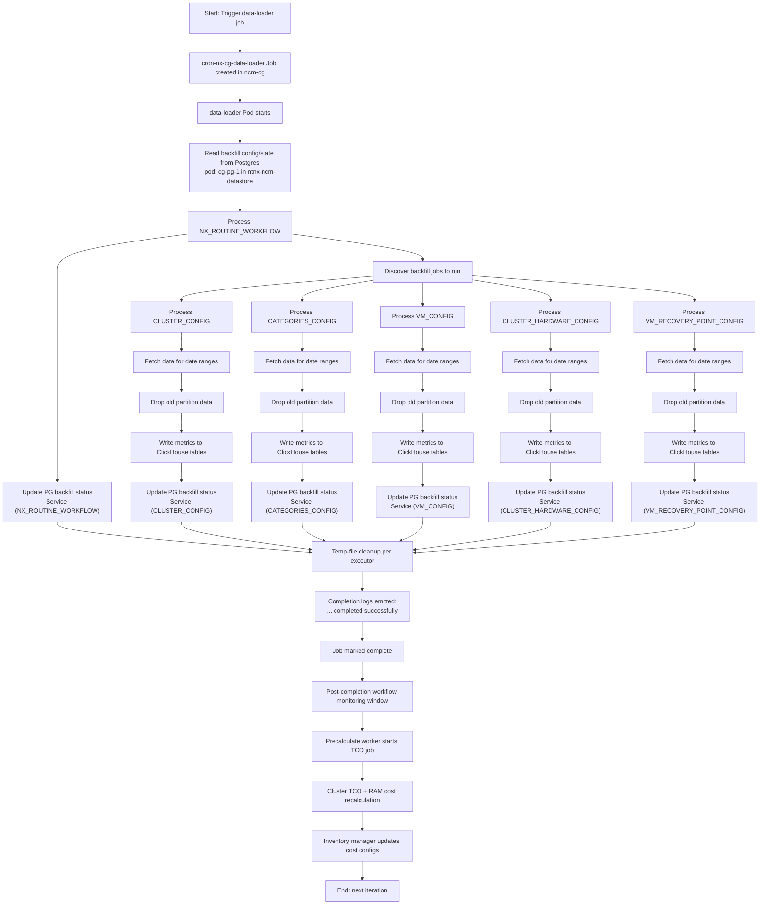
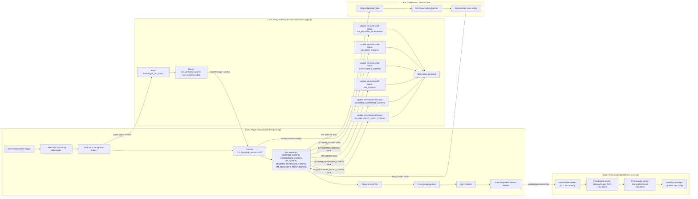
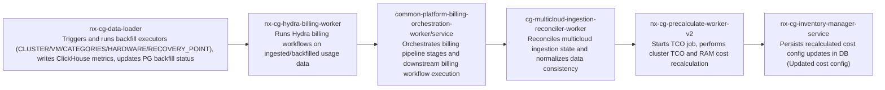

# Data Loader Success Flowcharts

## End-to-End Flow



## Pod-to-Pod Swimlane



## Pod-to-Pod Execution Order (with work)



### Must-See Log Pattern Per Pod

- `nx-cg-data-loader`: `NDP Data fetching: .* completed successfully` and `Updating service backfill status for Service :\[.*\]`
- `nx-cg-hydra-billing-worker`: `hydra` / `billing` workflow start-complete markers (environment-specific wording)
- `common-platform-billing-orchestration-worker/service`: `orchestration` / `workflow` stage transition logs
- `cg-multicloud-ingestion-reconciler-worker`: `reconcile` / `ingestion` state update logs
- `nx-cg-precalculate-worker-v2`: `TCO Job Starting for jobId`, `Starting Cluster TCO calculation`, `Starting RAM cost calculation`
- `nx-cg-inventory-manager-service`: `Updated cost config`

### Quick Grep Commands

```bash
# 1) Data-loader completion + PG status updates
rg "NDP Data fetching: .* completed successfully|Updating service backfill status for Service :\\[.*\\]" /Users/mohan.as1/workspace/mohan_helpers/pod-logs/nx-cg-data-loader-*.log

# 2) Hydra billing
rg -i "hydra|billing|workflow|completed|failed" /Users/mohan.as1/workspace/mohan_helpers/pod-logs/nx-cg-hydra-billing-worker-*.log

# 3) Platform billing orchestration
rg -i "orchestration|workflow|stage|completed|failed" /Users/mohan.as1/workspace/mohan_helpers/pod-logs/common-platform-billing-orchestration-*.log

# 4) Multicloud reconciler
rg -i "reconcile|ingestion|state|completed|failed" /Users/mohan.as1/workspace/mohan_helpers/pod-logs/cg-multicloud-ingestion-reconciler-worker-*.log

# 5) Precalculate TCO/cost recalculation
rg "TCO Job Starting for jobId|Starting Cluster TCO calculation|Starting RAM cost calculation" /Users/mohan.as1/workspace/mohan_helpers/pod-logs/nx-cg-precalculate-worker-v2-*.log

# 6) Final DB-side cost persistence
rg "Updated cost config" /Users/mohan.as1/workspace/mohan_helpers/pod-logs/nx-cg-inventory-manager-service-*.log
```


flowchart TD
    %% Kubernetes layer
    A[cron-nx-cg-data-loader CronJob] -->|Creates| B(nx-cg-data-loader Pod)
    B -->|Schedules via gRPC| C[NxBillingWorkflow]

    %% Temporal layer
    subgraph Temporal Workflow Orchestration

        C --> D[CgMulticloudBillingIngestionWf]

        subgraph Ingestion
            D --> E[CgMulticloudBillingNxSemiEnrichmentPushSubWf]
            E --> F[CgNxBillingIngestionSubWf]
        end

        F --> G[BillingPostProcessWorkflow]

        %% Parallel jobs triggered post-ingestion
        G --> H[MlForecastWorkflow]
        G --> I[ExpiredBudgetWorkflow]

        %% Routine jobs
        G --> J[WorkerModuleRoutineWorkflow]
        J --> K[PrecalculateModuleRoutineWorkflow]
        K --> L[HydraModuleRoutineWorkflow]

    end
